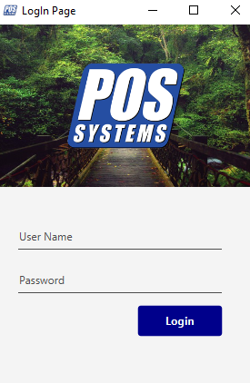
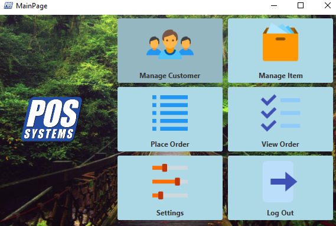
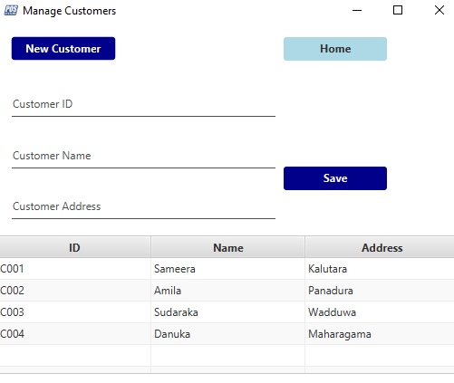
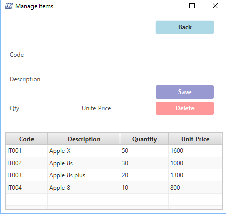
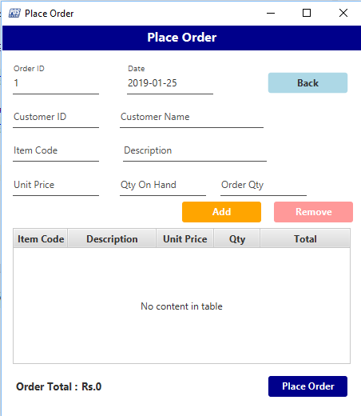
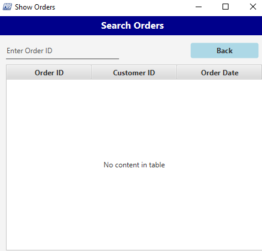
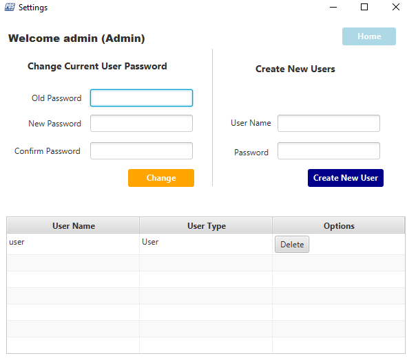
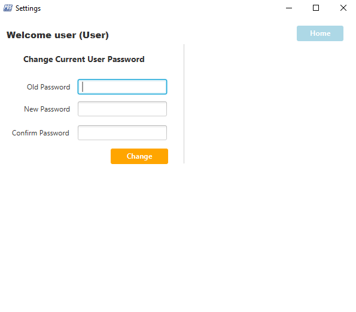
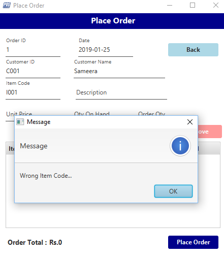

# In Memory POS System

### Project Description

This project is developed using the Java object oriented programming concept ( Encapsulation , Polymorphous , inheritance and Abstraction ),Array etc.. and how those concepts are implemented using Java SE and Java FX. 

Any Database is not used in the project and Data is stored in the memory so that data is only available at the executing time of the application. 

### Main Features of the project

* Logging Management - There are three user groups in the system which are **system** , **admin** and **user**. Based on the user, simple access restriction is implemented. 

* Authorized User can create new customers in the system , view existing customers in the system and delete or modify customers in the system.

* Authorized User can add new Item in to the system , view existing items in the system and delete or modify items in the system.

* Authorized User can create new orders and view orders.

* Authorized User can create new users to the system , view existing users , modify and delete existing uses from the system

#### Login Page

---
#### Home Page

#### Manage Customer

#### Manage Item

#### Place Order

#### Search Order

#### Admin Settings

#### User Settings

#### Place Order Item select But Input QTY more than..

